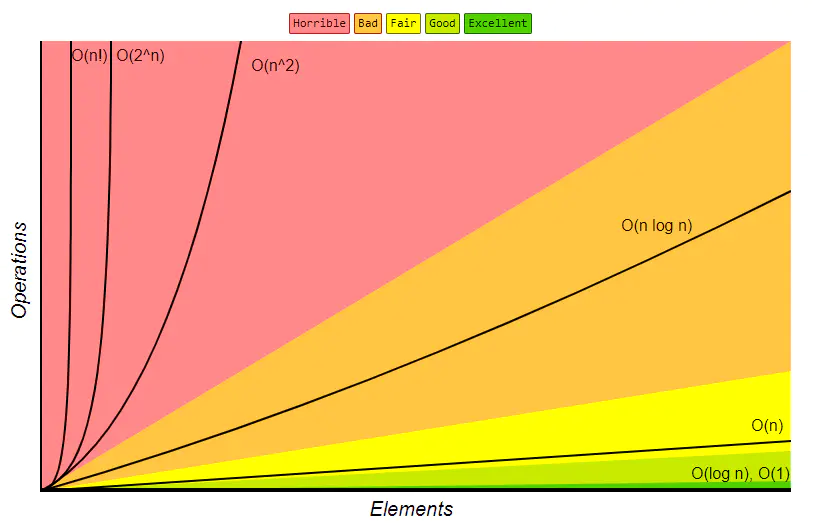

# 算法的时间与空间复杂度

- **时间复杂度：** 当前算法所消耗的时间
- **空间复杂度：** 当前算法所占用的内存空间

## 复杂度分析

1. 数据结构和算法解决的是：如何让计算机更快、更省空间的问题
2. 需要从两个维度来评估：执行时间和占用内存空间
3. 时间复杂度和空间复杂度两个概念来描述性能问题，二者统称复杂度
4. 复杂度描述的是算法**执行时间或占用内存空间**与**数据规模**的增长关系


### 大 O 符号表示法

**来源：**

算法的执行时间与每行代码的执行次数成正比，用 T(n) = O(f(n)) 表示，其中 T(n) 表示算法执行总时间，f(n) 表示每行代码执行总次数，而 n 往往表示数据的规模。


**复杂度分析法则**

1. 单段代码开高频：比如循环...
2. 多段代码取最大：比如一段代码中有单循环和多重循环，那么取多重循环的复杂度
3. 嵌套代码求乘积：比如递归、多重循环等
4. 多个规模求加法：比如有两个参数控制两个循环的次数，那么就取二者复杂度相加

**常用的复杂度级别**

多项式阶：随着数据规模的增长、算法的执行时间和内存空间占用，按照多项式的比例增长，包括

1. O(1) 常数阶
2. O(logn)（对数阶）
3. O(n)（线性阶）
4. O(nlogn)（线性对数阶）
5. O(n^2)（平方阶）
6. O(n^3)（立方阶）

非多项式阶：随着数据规模的增长，算法的执行时间和内存空间占用暴增，这类算法性能极差。包括

1. O(2^n)（指数阶）
2. O(n!)（阶乘阶）


> 如果一个问题的规模是 n，解这一问题的某个算法缩需要的时间为 `T(n)`。`T(n)` 称为这一算法的 **时间复杂度**。当输入量 n 逐渐加大时，时间复杂度的极限情形称为算法的 **渐进时间复杂度**。
>
>  **空间复杂度同理**


>  *大O符号表示法，并不是真实代表算法执行时间和空间的，他是用来表示代码执行时间和空间的增长变化趋势的。*





## 常见的时间复杂度量级

- 常数阶 O(1)

> 随着数据规模n增大，对应算法的时间复杂度不变

- 对数阶 O(logN)

> 随着数据规模n增大，对应算法的时间复杂度成对数曲线logn变化

- 线性阶 O(n)

>  随着数据规模n增大，对应算法的时间复杂度成线性曲线n变化

- 线性对数阶 O(nlogN)

> 随着数据规模n增大，对应算法的时间复杂度成线性对数曲线nlogn变化

- 平方阶 O(n²)

> 随着数据规模n增大，对应算法的时间复杂度成平方级n^2变化

- 立方阶 O(n³)

> 随着数据规模n增大，对应算法的时间复杂度成立方级n^3变化

- K次方阶 O(n^k)

> 随着数据规模n增大，对应算法的时间复杂度成n^k次方级变化

- 指数阶 (2^n)

> 着数据规模n增大，对应算法的时间复杂度成2^n次方级变化

- 阶乘级 O(n!) 

> 随着数据规模n增大，对应算法的时间复杂度成n!阶乘级变化

**上面从上至下依次的时间复杂度越来越大，执行效率越来越低**


1. **常数阶 O(1)**

无论代码执行了多少行，只要没有循环等复杂结构，那么这个代码的时间复杂度就都是 O(1)

```js
let i = 1;
let j = 2;
++i;
j++;
let x = i + j;
```

> 上述代码在执行的时候，消耗时间并不会随着某个变量的增长而增长。


2. **对数阶 O(logN)**

```js
let i = 1;
while (i < n) {
  i = i * 2
}
```

[时间复杂度 O(log n) 意味着什么？ (juejin.cn)](https://juejin.cn/post/6844903481191432206)

> 循环内每次都将 i * 2, 执行x次循环后，i>n，此时推出循环
>
> 2的x次方 = n，那么 x = log2^n


3. **线性阶 O(n)**

```js
for (i = 1; i <= n; ++i) {
  j = i;
  j++
}
```

> for 循环里的代码会执行 n 遍，因此它消耗的时间是随着 n 的变化而变化


4. **线性对数阶 O(nlogN)**

```js
for (x = 1; y < x; x++) {
  i = 1;
  while (i < n) {
    i = i * 2
  }
}
```

> O(nlogN)，将时间复杂度为 `O(logn)` 的代码循环 n 遍
>
> 它的时间复杂度就是 n * O(logN)，也就是 O(nlogN)


5. **平方阶 O(n²)**

```js
for (x = 1; x <= n; x++) {
  for (i = 1; i <= n; i++) {
    j = i;
    j++
  }
}
```

> 如果把 O(n) 的代码在嵌套循环一遍
>
> 它的时间复杂度就是 O(n * n) = O(n²)

6. **立方阶 O(n³)** 相当于三层 n 循环


## 常见的空间复杂度量级

- **常数级 O(1)**

> 随着数据规模n增大，对应算法的空间复杂度不变

- **线性级 O(n)**

> 随着数据规模n增大，对应算法的空间复杂度成线性曲线n变化

- **平方级 O(n^²)**

> 随着数据规模n增大，对应算法的空间复杂度成立方曲线n^2变化

