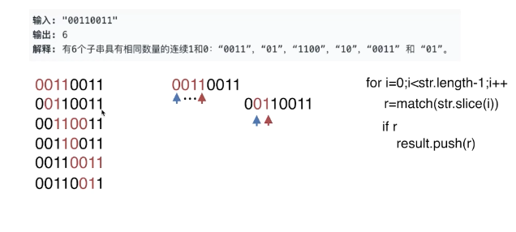

# 字符串

## 字符串单词反转

### 知识点

- `String.prototype.split`
- `String.prototype.match`
- `Array.prototype.map`
- `Array.prototype.reverse`
- `Array.prototype.join`

## 计数二进制子串

[leetcode](https://leetcode-cn.com/problems/count-binary-substrings/)

